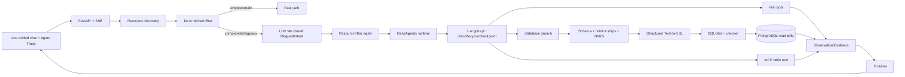

# Architecture

## Runtime ownership

- DeepAgents：高层 runtime scaffold、todo middleware、skills、workspace backend、registered tool calling。
- LangGraph：plan state、checkpoint、interrupt/resume、thread lifecycle。
- ScientificAgentState：业务 state、observations、evidence、limits 和 final answer。
- Deterministic tools：所有数值计算与 SQL 执行；LLM 不重算 MAE/count。

`create_deep_agent` 位于 `app/agents/deep_runtime.py`。传入 custom tools `register_runtime_context` 与 MCP-backed `get_molecule_features`；传入 selected skill paths、隔离 `FilesystemBackend` 和当前 LangGraph saver。无 API 时使用明确标记的 deterministic offline chat model 来验证真实 DeepAgents loop；有 API 时切换 ChatOpenAI-compatible model。

## Persistence

- PostgreSQL 55432：synthetic science schema、file metadata、LangGraph checkpoints。
- `agent_reader`：只读查询账号。
- `scientific`：metadata/checkpoint 管理账号。
- MinIO 9000：原始上传对象。
- Workspace：按需下载的 thread-local 临时副本。

未配置基础设施环境变量时保留 SQLite/local/InMemory fallback，以保证离线测试和原 Mixed Demo 不退化。

